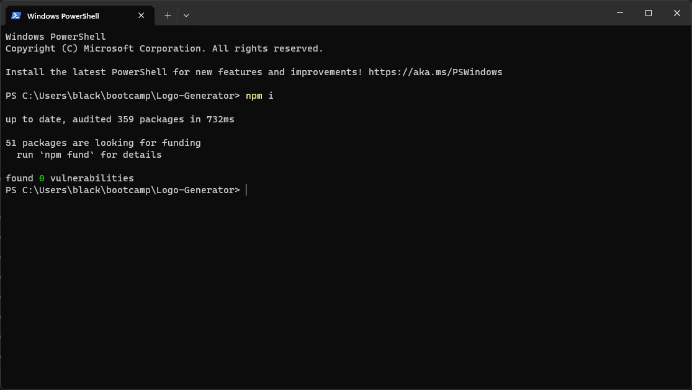
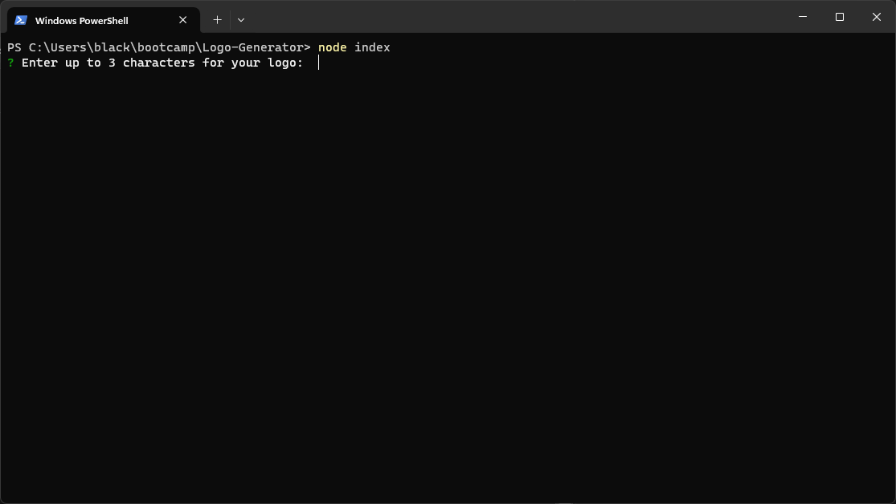
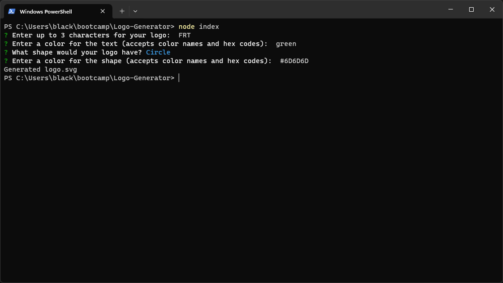
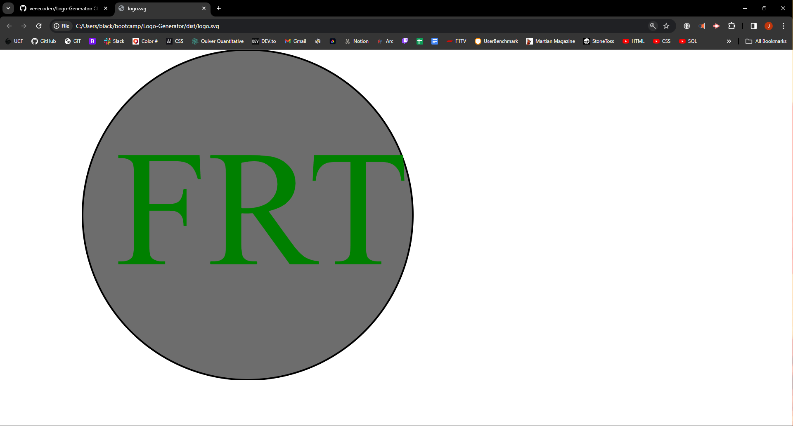

# Logo Generator

## Description
I wanted to test my grasp of the concepts of object oriented programming and this project puts all of those in use at the same time, this app allows the user to generate a logo based on their desired characteristics
## Table of Contents
- [Installation](#installation)
- [Usage](#usage)
- [Questions](#questions)
- [Credits](#credits)
- [Walkthrough](#walkthrough)

## Installation
Install the npm package required using the 'npm i' command

## Usage
Initialize the app with the command 'node index.js'

Answer the questions about the specifics of the logo you want

After answering all the questions your logo will be rendered and you'll find your file in svg format inside the ./dist folder in the app main directory

## Tests
Unit tests are included, use the 'npm test' command to run them

## Questions
For questions contact me at [Github](https://github.com/Venecoderr) or [Email me](mailto:josefrm.55@gmail.com)

## Walkthrough

https://watch.screencastify.com/v/SdidkLWFtLXMyDlPcJqH
